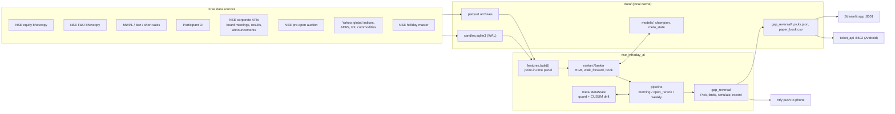

# NSE Gap-Reversal Book — Architecture

Developer: Shine · Package: `src/nse_intraday_ai` · Python ≥ 3.11

## 1. What the system does

Each NSE trading day it publishes a list of **8 stocks to short intraday**:
the liquid names most likely to give back yesterday's overnight gap-up. Ranker lists
enter at the open (pre-open market order). Lists ranked by the gap rule enter with a
**pre-open SELL LIMIT** at `prev_close × (1 − 0.75%)`, rounded up to the tick
(unfilled orders are cancelled at 09:15; `GapReversalConfig.entry_limit_for`). The stop is a buy-stop at entry + 0.75 × the 14-day ATR,
and the position is covered at 15:15. A gradient-boosted **ranker** orders the candidates.
It is promoted only on walk-forward evidence and guarded by a live paired record against the plain gap rule.
A paper book records every session from official NSE bars, and the system learns from it every day.

## 2. High-level architecture



## 3. Modules

| Module | Role |
|---|---|
| `nse_bhav`, `nse_fo`, `nse_extra`, `nse_flows` | Download and cache NSE daily files: equity bhavcopy (incl. delivery %), F&O bhavcopy, MWPL/ban/short-sale files, and participant-wise OI. Holidays are cached as `.holiday` markers. |
| `nse_corp` | NSE corporate APIs (board meetings, financial results, Integrated Filing, announcements) with monthly parquet caches and manifests. Provides point-in-time catalyst features (`corp_features`). |
| `nse_preopen` | Fetches and archives the pre-open call-auction snapshot. Encodes the auction timing regimes (09:08 before 2026-09-07, then 09:10 with random closure). |
| `nse_calendar` | NSE trading holidays: the holiday-master API (7-day cache) plus bhav markers. |
| `candle_cache` | SQLite (WAL) cache of Yahoo daily/5-minute candles: global series, the fallback path, and replay. |
| `features` | `load_inputs()` → `build()`: one row per (session, symbol), every feature dated strictly before the decision time, ±inf → NaN. It defines the feature groups `OPEN_FEATURES`, `PREOPEN_FEATURES`, `CORP_FEATURES` and the gate `UNVALIDATED_FEATURES`. |
| `ranker` | `Ranker` (sklearn HistGB by default; LightGBM regression/LambdaRank optional) with `walk_forward()`, `book()`, `summarize()`, `paired()`. Also the selection-bias controls `deflated_sharpe()` and `holm()`, plus champion persistence. |
| `meta` | `MetaState`: a paired per-expert daily record (*guard*: trade the ranker unless it is worse than the rule at t < −2 over 60 sessions), a CUSUM drift alarm with cautious mode, and diagnostic Hedge weights. |
| `pipeline` | `morning()` (08:45 list), `open_rerank()` (09:10:30, archives the auction and re-ranks if an open model is promoted), `learn_from()` (grades yesterday) and `weekly()` (retrain, walk-forward, promote on evidence). |
| `gap_reversal` | The book itself: `GapReversalConfig`, `Pick`, tick-size and entry-limit rules, the rule ranker, daily and 5-minute simulators, the picks file, and the paper record. It also holds the Yahoo fallback path. |
| `costs` | Groww/NSE MIS round-trip cost model (brokerage, STT, exchange, SEBI, stamp, GST, slippage). |
| `alerts` | ntfy push (topic from `NTFY_TOPIC` or the git-ignored `data/notify.json`); Telegram is optional. |
| `atomic_io` | Atomic JSON writes and retrying reads, shared by every state file. |
| `app`, `gap_reversal_ui` | Streamlit dashboard with four pages (Today, Performance, Model, About). Plotly charts with zoom, a unified-hover data cursor, units and CSV export. |

Scripts (`scripts/`):

| Script | Role |
|---|---|
| `gap_reversal.py` | Subcommands `picks`, `final`, `levels`, `record`, `backtest`. |
| `learn.py` | The weekly or conditional retrain. |
| `health_check.py` | Checks units, app, memory, disk, data freshness and the book. |
| `daily_monitor.py` | Live-versus-expected report and phone summary. |
| `compare_rankers.py` | Production-faithful walk-forward A/B with Holm and DSR. |
| `backfill_nse.py`, `backfill_corp.py` | History backfills. |
| `ticket_api.py` | JSON API for the Android app. |

## 4. Daily data flow and schedule (systemd user timers, IST)

| Time | Unit | What happens |
|---|---|---|
| 08:45 Mon–Fri | `nse-gap-picks` | Holiday check, then `refresh()` the NSE files, corporate events and global closes. `learn_from(previous session)` updates the guard and CUSUM. Features are built for today and ranked by the guarded expert. Limits are attached and `picks.json` is written. Push. |
| 09:10:30 | `nse-gap-final` | Fetch and archive the pre-open auction. If a promoted open model passes its guard, re-rank and push the final list. Otherwise the 08:45 list stands. |
| 09:18 | `nse-gap-levels` | Push stop prices from the official opens; names that opened below their limit are marked NOT FILLED. |
| 15:40 | `nse-gap-record` | Record the session in `paper_book.csv` (5-minute path; `NO_FILL` rows for unfilled limits). |
| 19:00 daily | `nse-gap-learn` | `learn.py --if-needed` retrains on Saturdays, on a drift alarm, or when no review exists. It runs `weekly()`: walk-forward over the last 2 years with quarterly refits, and promotes each model only if it beats its reference with paired t ≥ 2 and a positive edge. |
| every 30 min | `nse-health` | `health_check.py`: failures exit 1, warnings exit 0. |
| always | `nse-signal-lab` | Streamlit on :8501. |

All timers use `Persistent=true`, so a job missed while the laptop was asleep runs at wake-up. The 08:45 list prints a LATE banner after 09:08.

## 5. Threading and process model

- Every scheduled job is a **separate short-lived process** (systemd oneshot); there are no long-running daemons apart from Streamlit and the optional ticket API.
- Downloads use small thread pools (`backfill(..., workers=2)`) and are rate-limited for NSE.
- Model training uses the libraries' native threads (sklearn HGB OpenMP / LightGBM `n_jobs=-1`). Heavy research jobs run under `systemd-run --user` with `Nice` and `MemoryMax` so they survive agent restarts and cannot starve the live jobs.
- Concurrency safety: JSON state uses atomic replace (`atomic_io`), SQLite runs in WAL mode, and parquet files are written once per day or month.

## 6. IPC and interfaces

- **Phone**: ntfy HTTPS push. The topic is secret-by-obscurity, so use a random one (`alerts.py --set-ntfy-topic`).
- **Android app**: polls `ticket_api.py` (`/tickets`, `/record`, `/portfolio`, `/health`) on the LAN. It has no authentication, so run it only on a trusted network.
- **Dashboard**: Streamlit on :8501 with XSRF protection on. Bind it to localhost or a firewalled LAN.
- No inter-process sockets otherwise: the processes share state through the files under `data/`.

## 7. Learning loop and safeguards

1. **Daily**: every expert's own top-8 is graded on the official outcome. That extends a paired record, and the *guard* uses it to choose which expert's list is traded. The CUSUM on the live book versus the walk-forward expectation raises a drift alarm and cautious mode (60% size) when the shortfall persists.
2. **Weekly**: a full point-in-time rebuild and walk-forward. Challengers are promoted only on out-of-sample evidence; the previous champion stays otherwise.
3. **Research gate**: new features are built but kept out of the live models (`UNVALIDATED_FEATURES`) until `compare_rankers.py` shows paired t ≥ 3 after a Holm correction. Deflated Sharpe charges for every trial so far (`docs/research-log.md`).

## 8. Directory layout

```
src/nse_intraday_ai/   package (18 modules)
scripts/               CLIs run by systemd and by hand
tests/                 pytest suite (unit + app smoke + script smoke)
deploy/                install.sh + systemd units/timers
android/               companion app (polls ticket_api)
docs/                  ARCHITECTURE.md (this), research-log.md
data/                  local caches and state (git-ignored except the universe CSV)
data/archive/          compressed archives of retired components' state
```
